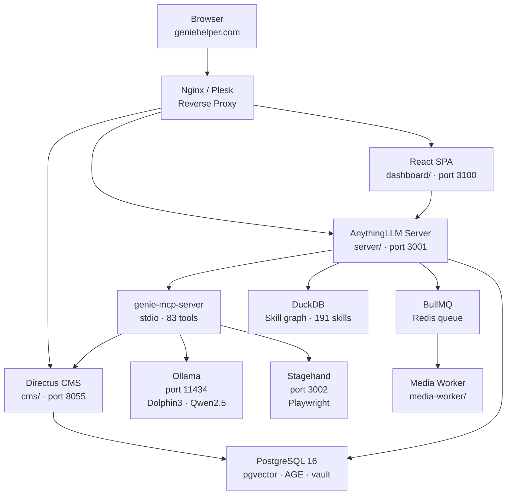
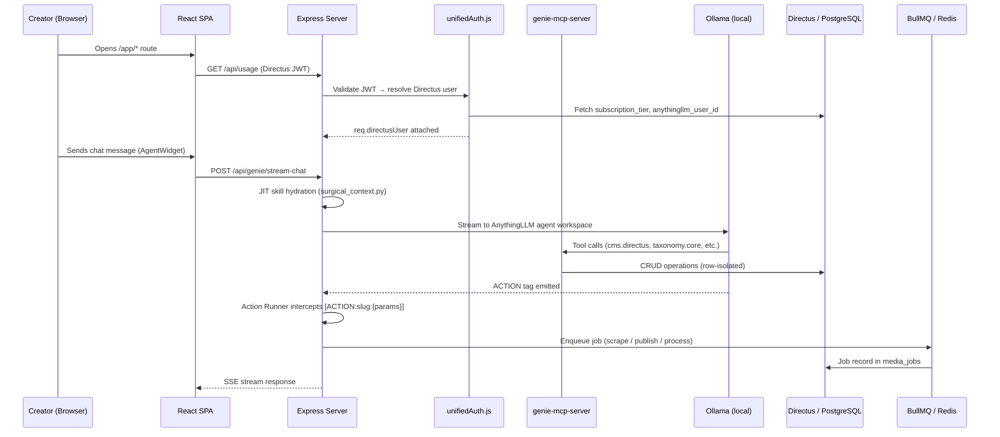
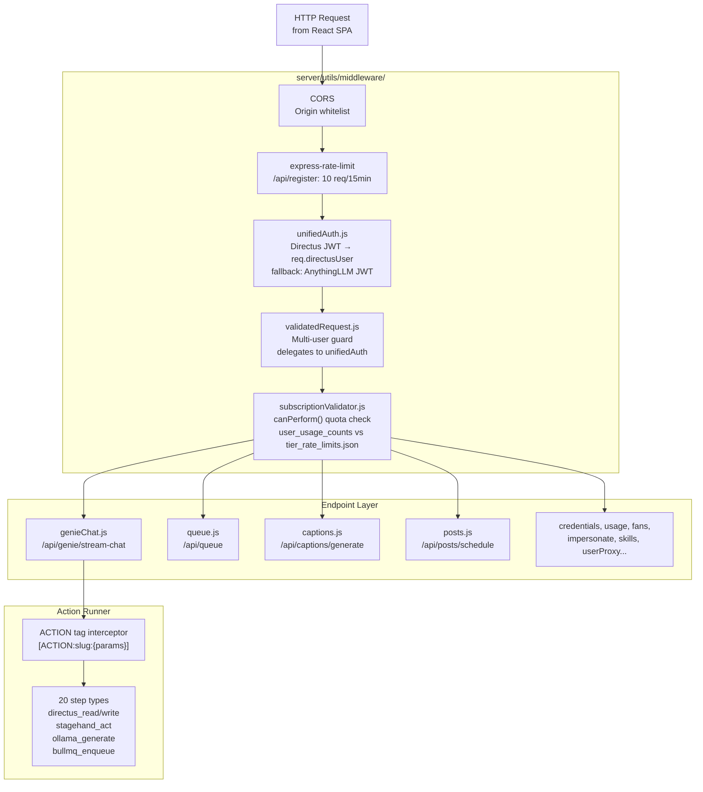

GenieHelper is a self-hosted, single-server platform. Every component — LLM inference, browser automation, job processing, and the React frontend — runs on one IONOS dedicated machine. Nothing leaves the VPS.

## Web architecture

All inbound traffic arrives at Nginx/Plesk, which reverse-proxies to three internal services based on path prefix. The React SPA is served as a static build; the two backend services (AnythingLLM server and Directus CMS) handle API and data concerns respectively.



<Note>
All Nginx configuration changes must be made through the Plesk UI. Never add a bare `location /` block — Plesk manages the root location. WebSocket upgrade headers are required for the AnythingLLM chat stream.
</Note>

---

## Services (PM2)

All long-running processes are managed by PM2. The table below is the authoritative service registry.

<CardGroup cols={2}>
  <Card title="anything-llm" icon="server">
    **Port:** 3001  
    **Tech:** Node.js, Express, Prisma  
    AnythingLLM fork. Mounts all GenieHelper custom endpoints and utilities. Calls `bootMCPServers()` on startup to launch the unified MCP server as a stdio child process.
  </Card>
  <Card title="agentx-cms" icon="database">
    **Port:** 8055  
    **Tech:** Directus 11, PostgreSQL  
    CMS and primary data layer. Owns all Directus collections, flows, roles, and policies. All server-side Directus writes go through the `cms.directus` MCP plugin — never via raw fetch from business logic.
  </Card>
  <Card title="stagehand-server" icon="globe">
    **Port:** 3002  
    **Tech:** Playwright (Stagehand fork)  
    Browser automation service. Used for platform scraping, HITL login sessions, and stat collection from OnlyFans, Fansly, and other platforms that block headless Chrome.
  </Card>
  <Card title="genie-dashboard" icon="layout-dashboard">
    **Port:** 3100  
    **Tech:** `serve dashboard/dist/`  
    Serves the pre-built React 18 + Vite SPA. Nginx proxies all `/app/*` and `/` routes here. The build output in `dashboard/dist/` must be rebuilt after any frontend change.
  </Card>
  <Card title="media-worker" icon="film">
    **Port:** none  
    **Tech:** BullMQ + Redis  
    Background job consumer. Processes 9 job types across `media-jobs`, `scrape-jobs`, and `onboarding-jobs` queues at `concurrency:1` to stay within the 16 GB RAM ceiling. Split into `operations/` modules as of 2026-03-15.
  </Card>
  <Card title="goose-web" icon="bot">
    **Port:** 3003  
    **Tech:** Goose AI agent  
    Secondary agent runtime for experimental task execution. Runs independently of the AnythingLLM agent workspace.
  </Card>
</CardGroup>

---

## Data flow — Creator session

This is the complete request lifecycle for a creator sending a chat message, from browser open through an ACTION-triggered BullMQ job.



<Steps>
  <Step title="JWT validation">
    The React SPA sends every request with a Directus JWT in the `Authorization: Bearer` header. `unifiedAuth.js` validates it against Directus `/users/me`, then bridges to the AnythingLLM Prisma user via `anythingllm_user_id`. Both user objects are attached to the request context.
  </Step>
  <Step title="JIT skill hydration">
    Before the chat message reaches the LLM, `surgical_context.py activate "<task>"` runs stimulus propagation across the DuckDB skill graph. The top-N most relevant skills for the current task are surfaced and injected into the agent system prompt. Skills that are irrelevant to the current task are never loaded — they would waste context budget.
  </Step>
  <Step title="LLM streaming">
    The message is forwarded to the AnythingLLM agent workspace via Server-Sent Events. The agent calls MCP tools (`cms.directus`, `taxonomy.core`, `memory.recall`, etc.) as needed. All Directus reads and writes are row-isolated to the authenticated user by Directus policy.
  </Step>
  <Step title="ACTION tag interception">
    When the LLM emits an `[ACTION:slug:{params}]` tag in its response stream, the Action Runner intercepts it before the text reaches the client. The tag is parsed, the matching flow is loaded from the `action_flows` Directus collection, and the 14-step execution engine runs the flow deterministically.
  </Step>
  <Step title="BullMQ job enqueue">
    Heavy operations (scraping, media processing, publishing) are handed off to BullMQ rather than blocking the SSE response. A job record is written to `media_jobs` in Directus, and the media worker picks it up asynchronously at `concurrency:1`.
  </Step>
  <Step title="SSE response">
    The final agent response — including any stage_update events that drive the React UI — is streamed back to the SPA over the open SSE connection. Stage events are parsed by `realtimeEventRouter.js` and dispatched to the `StageContext` reducer, which updates the UI layout without any explicit navigation.
  </Step>
</Steps>

---

## Middleware stack

Every HTTP request to the Express server passes through this chain in order. A failure at any layer returns immediately; the request never reaches the endpoint.



| Middleware | File | Responsibility |
|---|---|---|
| CORS | Express built-in | Origin whitelist enforcement |
| Rate limit | `express-rate-limit` | 10 req/15min on `/api/register` |
| `unifiedAuth` | `server/utils/middleware/unifiedAuth.js` | Validates Directus JWT, bridges to Prisma user, falls back to AnythingLLM JWT |
| `validatedRequest` | `server/utils/middleware/validatedRequest.js` | Multi-user guard; in multi-user mode, fully delegates to `unifiedAuth` |
| `subscriptionValidator` | `server/utils/subscriptionValidator.js` | `canPerform()` quota check — `user_usage_counts` vs `tier_rate_limits.json`, fail-closed |

<Warning>
`subscriptionValidator` is fail-closed. If the quota check fails for any reason — network error, missing record, unexpected exception — it returns `allowed: false, reason: 'quota_check_failed'`. The operation is denied, not permitted. Do not change this behavior.
</Warning>

---

## The Action Runner pattern

Small open-weight models (7B–8B) cannot reliably call structured JSON tool schemas. The Action Runner bypasses this limitation entirely by having the LLM emit a plain-text tag that the server intercepts before the response reaches the client.

### Tag format

```text
[ACTION:slug:{"param1":"value1","param2":"value2"}]
```

- `slug` — matches a flow definition in the `action_flows` Directus collection
- The JSON payload is the input to the first step of the flow

### Execution model

When `genieChat.js` detects an ACTION tag in the LLM stream, it pauses SSE forwarding, loads the matching flow from `action_flows`, and hands off to the Action Runner (`server/utils/actionRunner/`). The runner executes the flow step-by-step. Results are injected back into the stream as a structured event before SSE forwarding resumes.

### 20 step types

| Step type | What it does |
|---|---|
| `directus_read` | Read items from a Directus collection |
| `directus_write` | Create a new item in a Directus collection |
| `directus_update` | PATCH an existing item by ID |
| `directus_delete` | Delete an item from a Directus collection |
| `directus_search` | Full-text search across a Directus collection |
| `directus_trigger` | Fire a Directus Flow by UUID via webhook |
| `stagehand_start` | Launch a new headless Playwright session |
| `stagehand_navigate` | Navigate the browser session to a URL |
| `stagehand_act` | Natural language browser action (click, type, scroll) |
| `stagehand_extract` | Extract structured data from the current page |
| `stagehand_close` | End and clean up a browser session |
| `stagehand_cookie_login` | Decrypt stored credentials and inject cookies into a session |
| `stagehand_extract_cached` | Extract with in-process cache check |
| `ollama_generate` | Single-turn LLM completion via local Ollama |
| `ollama_chat` | Multi-turn chat completion via local Ollama |
| `taxonomy_terms_read` | Cached read of taxonomy terms for a platform |
| `taxonomy_platform_maps_read` | Cached read of platform-to-taxonomy mappings |
| `taxonomy_invalidate` | Bust the in-process taxonomy cache |
| `bullmq_enqueue` | Push a media job onto a BullMQ queue |
| `http_request` | Arbitrary HTTP request (webhooks, internal API calls) |
| `condition` | Branch the flow based on a boolean expression |
| `http_request` | Make an outbound HTTP request (internal services only) |

<Note>
Flows are seeded into the `action_flows` Directus collection. The six currently seeded flows are: `scout-analyze`, `taxonomy-tag`, `post-create`, `message-generate`, `memory-recall`, and `media-process`. New flows can be added without a server restart — the runner loads the flow definition at execution time.
</Note>

---

## Nginx / Plesk reverse proxy

The Nginx configuration is managed entirely through the Plesk control panel. The following proxy rules are in effect:

| Path prefix | Proxied to | Notes |
|---|---|---|
| `/api/*` | `http://localhost:3001` | AnythingLLM server; WebSocket upgrade headers required for `/api/genie/stream-chat` |
| `/directus/*` | `http://localhost:8055` | Directus CMS admin and API |
| `/*` | `http://localhost:3100` | Dashboard SPA catch-all |

<Warning>
Never add a `location /` block directly in the Nginx config file. All location blocks that conflict with Plesk's generated config will be overwritten on the next Plesk regeneration. Make all changes through the **Plesk &gt; Domains &gt; geniehelper.com &gt; Apache &amp; nginx Settings** panel.
</Warning>

WebSocket headers required for the SSE/streaming endpoint:

```nginx
proxy_http_version 1.1;
proxy_set_header Upgrade $http_upgrade;
proxy_set_header Connection "upgrade";
proxy_read_timeout 86400;
```
