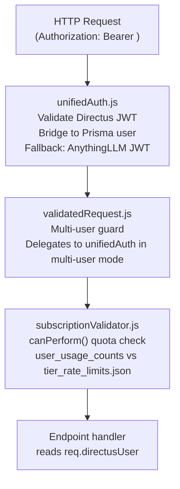

GenieHelper uses a single Directus JWT accepted across all endpoints — both the custom GenieHelper routes and the upstream AnythingLLM native routes. The `unifiedAuth.js` middleware bridges the Directus identity to the AnythingLLM Prisma user, so the creator authenticates once and gains access to the full platform.

---

## Auth middleware chain

Every authenticated request passes through three middleware layers in order:



<Steps>
  <Step title="unifiedAuth.js">
    Extracts the Bearer token and attempts Directus JWT validation first. On success, it fetches the `subscription_tier` and `anythingllm_user_id` fields via the admin token (these fields are restricted by the Base Policy and cannot be fetched by the user's own token). It then bridges to the AnythingLLM Prisma user via `anythingllm_user_id`, attaching both user objects:

    - `req.directusUser` — read by all GenieHelper custom endpoint handlers
    - `res.locals.user` — read by all upstream AnythingLLM native endpoint handlers
    - `res.locals.multiUserMode = true`

    If Directus validation fails, it falls back to the upstream AnythingLLM JWT path for backwards compatibility.
  </Step>
  <Step title="validatedRequest.js">
    The upstream AnythingLLM multi-user guard. In multi-user mode (which is always the case in GenieHelper), it fully delegates to `unifiedAuth`. This ensures the Directus JWT works transparently across all routes, including the upstream AnythingLLM workspace and chat endpoints.
  </Step>
  <Step title="subscriptionValidator.js">
    Runs `canPerform(userId, operationType, directusClient)` for quota-gated operations. Reads `user_usage_counts` from Directus and compares against `config/tier_rate_limits.json`. This check is **fail-closed** — any error in the quota check (network failure, missing record, unexpected exception) returns `allowed: false, reason: 'quota_check_failed'`. The operation is denied, not permitted.
  </Step>
</Steps>

---

## Directus → AnythingLLM bridge

Creator accounts exist in two systems: Directus (the CMS and primary identity store) and AnythingLLM (the agent runtime with its own Prisma database). The bridge links them.

| Field | Collection | Purpose |
|---|---|---|
| `anythingllm_user_id` | Directus `directus_users` | Stores the Prisma user ID from AnythingLLM's database. Set at registration time by `register.js` after both users are created. |
| `subscription_tier` | Directus `directus_users` | Creator's current tier (`starter`, `creator`, `pro`, `studio`). Read during auth to determine quota limits and feature access. |

If `anythingllm_user_id` is missing on a valid Directus user, `unifiedAuth` returns HTTP 503 with code `ANYTHINGLLM_USER_MISSING`. This indicates a broken account state requiring the RBAC sync webhook to be re-run.

```bash
# Re-run RBAC sync for a broken account
curl -X POST https://geniehelper.com/api/rbac-sync \
  -H "X-Webhook-Secret: $RBAC_SYNC_WEBHOOK_SECRET" \
  -H "Content-Type: application/json" \
  -d '{"userId": "<directus-user-id>"}'
```

---

## RBAC roles

Directus roles control both data access (via item-level policies) and feature access (via tier-based feature flags in the React frontend).

<CardGroup cols={2}>
  <Card title="Base Policy" icon="shield">
    Applied to all subscriber tiers (Starter, Creator, Pro, Studio). Grants read/write access to owned collections with `user_id=$CURRENT_USER` row filters. Cannot access other creators' data.
  </Card>
  <Card title="Pro Policy" icon="shield-check">
    Applied to Pro and Studio tiers in addition to Base Policy. Unlocks extended fan CRM fields, advanced analytics collections, and higher quota limits defined in `tier_rate_limits.json`.
  </Card>
  <Card title="Admin bypass" icon="shield-alert">
    The `poweradmin` role bypasses all quota checks. Additionally, if `ANTHROPIC_API_KEY` is set in `server/.env`, the admin gets Claude API access (Anthropic) instead of the local Ollama models.
  </Card>
  <Card title="Per-user workspace isolation" icon="lock">
    Enforced at the Directus policy layer — `user_id=$CURRENT_USER` row filter is applied to all creator-owned collections. Data isolation does not depend on application-level logic. Do not remove these filters.
  </Card>
</CardGroup>

<Warning>
The `user_id=$CURRENT_USER` row filters on all owned collections are security-critical. They are the enforcement point for multi-tenant data isolation. Never remove or bypass them, even for debugging or admin tooling. Use the `poweradmin` role or the impersonate endpoint for admin access to specific user data.
</Warning>

---

## Subscription quota enforcement

`subscriptionValidator.js` implements a `canPerform()` function that gates quota-limited operations.

```javascript
// Usage in endpoint handlers
const { canPerform } = require('../utils/subscriptionValidator');

const check = await canPerform(req.directusUser.id, 'caption_generation', directusClient);
if (!check.allowed) {
  return res.status(429).json({ error: check.reason, remaining: check.remaining });
}
```

**How it works:**

1. Reads `user_usage_counts` from Directus for the authenticated user — the current billing cycle's operation counts
2. Reads `config/tier_rate_limits.json` for the user's subscription tier
3. Compares current usage against the tier limit for the requested `operationType`
4. Returns `{ allowed: boolean, reason: string, remaining: number }`

**Fail-closed behavior:** If any step fails (Directus unreachable, record missing, JSON parse error), the function returns `{ allowed: false, reason: 'quota_check_failed' }`. This is intentional — the alternative (fail-open) would silently over-serve users when the quota system has an error.

The operation types that are quota-gated:

| Operation type | Description |
|---|---|
| `caption_generation` | AI caption generation via `/api/captions/generate` |
| `scheduled_queue_size` | Maximum posts in the scheduled queue at one time |
| `chat_messages` | Chat messages to the agent workspace per billing cycle |
| `scrape_runs` | Platform scrape jobs per billing cycle |
| `broadcast_sends` | Message broadcasts per billing cycle |

---

## Credential encryption

Platform credentials (OnlyFans session tokens, Fansly cookies, Instagram auth, etc.) are encrypted with AES-256-GCM per user before storage. The encryption key never leaves `server/.env`.

```javascript
// server/utils/credentialsCrypto.js
const encrypted = encryptJSON(plainCredentials, process.env.CREDENTIALS_ENC_KEY_B64);
const plain = decryptJSON(encrypted, process.env.CREDENTIALS_ENC_KEY_B64);
```

Credentials are stored in the `supabase_vault` PostgreSQL extension and accessed via the `credentials.js` endpoint (`POST /api/credentials` to store, `GET /api/credentials` to retrieve). The endpoint enforces that a user can only read their own credentials — the `req.directusUser.id` from `unifiedAuth` is used as the isolation key, not any value from the request body.

---

## Required environment variables

<Warning>
All four of these environment variables are required for the auth and security subsystems to function. Missing values will cause silent failures in quota enforcement, Directus communication, or credential decryption.
</Warning>

| Variable | File | Purpose |
|---|---|---|
| `CREDENTIALS_ENC_KEY_B64` | `server/.env` | Base64-encoded 256-bit AES-GCM key for platform credential encryption. Losing this key means losing access to all stored credentials. |
| `DIRECTUS_ADMIN_TOKEN` | `server/.env` | Used exclusively by `register.js` and `rbacSync.js` — pre-auth flows that require admin access to create users and sync roles. Stale tokens cause 401 errors on registration. |
| `MCP_SERVICE_TOKEN` | `server/.env` | Scoped service token used by all other server-side Directus reads and writes. Lower privilege than `DIRECTUS_ADMIN_TOKEN`. Used by `unifiedAuth` to fetch restricted user fields and by all endpoint handlers for Directus operations. |
| `RBAC_SYNC_WEBHOOK_SECRET` | `server/.env` | Shared secret validating the Directus → `rbacSync.js` webhook. Must match the secret configured in the Directus Flow that fires on user role changes. |

---

## Registration flow

Registration is invite-gated. New accounts are created by `register.js` (`POST /api/register`):

<Steps>
  <Step title="Invite validation">
    The registration request must include a valid invite token. Rate-limited to 10 requests per 15 minutes per IP via `express-rate-limit`.
  </Step>
  <Step title="Directus user creation">
    A new Directus user is created with the appropriate role for the selected tier, using the `DIRECTUS_ADMIN_TOKEN`. The default tier is controlled by the `DEFAULT_NEW_USER_TIER` environment variable (defaults to `pro`).
  </Step>
  <Step title="AnythingLLM user creation">
    A corresponding Prisma user is created in the AnythingLLM database. The Prisma user ID is written back to the Directus user as `anythingllm_user_id`.
  </Step>
  <Step title="Workspace provisioning">
    `workspaceProvisioner.js` creates a private AnythingLLM workspace for the new creator, fetches the `prime_directive` system prompt from Directus `system_config`, and applies it to the workspace.
  </Step>
  <Step title="RBAC sync">
    The `rbacSync.js` webhook syncs the Directus role assignment to AnythingLLM workspace permissions, ensuring the new creator has access to the correct feature set for their tier.
  </Step>
</Steps>
