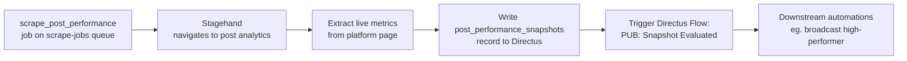
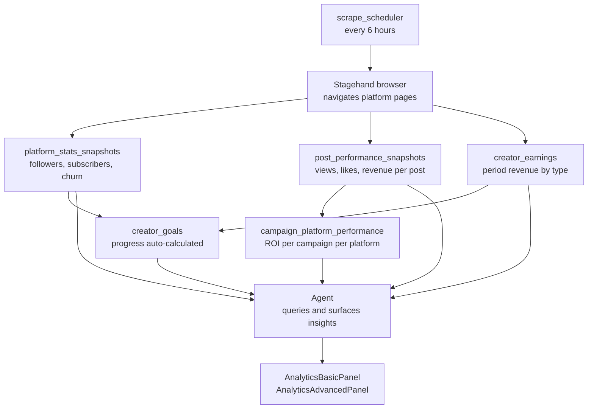

Analytics in GenieHelper are layered by purpose: per-post engagement is separate from period revenue rollups, which are separate from account-level growth curves. This separation keeps the data model clean and makes queries fast — you are never aggregating per-post data to get a revenue summary.

<Info>
  Analytics data is sourced from platform scrapes via Stagehand, not from platform APIs. This means data freshness is tied to scrape frequency (every 6 hours by default for the `scrape_scheduler`) and to HITL scrape sessions when platforms block headless Chrome.
</Info>

## Earnings history

Earnings are tracked in `creator_earnings` as period-by-period revenue records. Each record represents one revenue period for one platform and one content type.

### What earnings records contain

| Field | Description |
|---|---|
| Period | Date range (daily, weekly, or monthly depending on platform reporting) |
| Platform | Which platform this revenue came from (OnlyFans, Fansly, etc.) |
| Content type | Subscription revenue, PPV, tips, custom content, referrals |
| Gross amount | Platform-reported gross before fees |
| Net amount | After platform percentage and any applicable taxes |
| Currency | ISO currency code |

Earnings records are append-only. Each scrape writes new period records; existing records are not updated. This preserves the audit trail and allows trend analysis over time.

### Revenue breakdown

Creators can slice earnings by:

- **Platform** — which platforms are generating the most revenue
- **Content type** — whether subscriptions, PPV, or tips are the primary driver
- **Time period** — daily, weekly, monthly, or custom date range
- **Campaign attribution** — which campaigns drove measurable revenue lift (via `campaign_platform_performance`)

## Creator goals

Creator goals in `creator_goals` let creators set revenue, subscriber, or engagement targets with automatic progress tracking.

### Goal types

| Type | Examples |
|---|---|
| Revenue | Hit $5,000/month net, reach $50,000 annual gross |
| Subscriber count | Reach 1,000 active OnlyFans subscribers, maintain Fansly subscriber count above 500 |
| Engagement | Achieve 40% average open rate on broadcasts, hit 20 PPV purchases per week |

### Progress tracking

Goal progress is calculated automatically by comparing the goal target against the most recent relevant data:

- Revenue goals compare against `creator_earnings` sum for the goal period
- Subscriber count goals compare against the latest `platform_stats_snapshots` subscriber count
- Engagement goals compare against `post_performance_snapshots` averages

Progress is surfaced in the `AnalyticsAdvancedPanel` (right wing) and can be called up in chat. The agent monitors goal progress and can proactively alert the creator when a goal is at risk or has been reached.

<Tip>
  The agent can create and update creator goals via conversation. Say "set a goal to reach 1,000 OnlyFans subscribers by June" and the agent will create the record and start tracking it.
</Tip>

## Platform growth curves

Platform growth is tracked as a time series in `platform_stats_snapshots` — one record per platform per scrape cycle.

### What each snapshot contains

| Field | Description |
|---|---|
| Platform | Which platform this snapshot belongs to |
| Follower count | Total followers at snapshot time |
| Subscriber count | Total active paid subscribers |
| Churn rate | Percentage of subscribers who cancelled in the snapshot period |
| New subscribers | Net new subscribers since the last snapshot |
| Snapshot timestamp | When this data was collected |

Snapshots build up a growth curve over time. The `AnalyticsAdvancedPanel` renders this as a time series chart. The agent can identify growth inflection points and correlate them with campaign activity or posting frequency changes.

<Note>
  `platform_stats_snapshots` is append-only. The current state of a platform connection lives on the `platform_connections` record; historical trends live in snapshots. Never read current subscriber counts from snapshots — always use the connection record.
</Note>

## Campaign ROI

Campaign performance is broken down per platform in `campaign_platform_performance`.

### Per-campaign metrics

| Metric | Source |
|---|---|
| Impressions | Scraped from platform post analytics |
| Clicks | Link click counts from platform reporting |
| Conversions | New subscribers or PPV purchases attributed to the campaign |
| Revenue | Gross revenue attributed within the campaign attribution window |
| ROI | (Revenue − Cost) / Cost, where cost is entered manually by the creator |

Campaign ROI is visible in the `AnalyticsAdvancedPanel` and can be queried in chat. The agent uses campaign performance data to recommend which content types and platforms to prioritize for future campaigns.

## Post performance snapshots

Per-post engagement is tracked in `post_performance_snapshots`. Each record captures the live metrics for a specific post at a specific point in time.

### What a performance snapshot contains

| Field | Description |
|---|---|
| Post reference | Link to the `content_posts` record |
| Platform | Which platform this performance data is from |
| Snapshot timestamp | When this data was collected |
| Views | Total view count at snapshot time |
| Likes | Total like count |
| Comments | Total comment count |
| Shares | Total share count (where platform exposes it) |
| Link clicks | CTA link click count (where trackable) |
| Revenue | PPV revenue attributed to this post |

### How snapshots are collected

Post performance data is collected by the `scrape_post_performance` handler in `operations/publish.js`. It uses Stagehand to navigate to each post's analytics view on the platform and extract the current metrics.

After writing the snapshot record, the handler triggers the "PUB: Snapshot Evaluated" Directus Flow, which can fire downstream automations — for example, promoting a high-performing post to a segment broadcast.

<Note>
  The `scrape_post_performance` handler was added on 2026-03-15 and is registered on the `scrape-jobs` BullMQ queue, not `media-jobs`. This keeps browser automation jobs separate from FFmpeg processing jobs.
</Note>

## Key collections reference

| Collection | Layer | Purpose |
|---|---|---|
| `creator_earnings` | Period rollup | Revenue by platform and content type per period |
| `creator_goals` | Targets | Revenue, subscriber, and engagement goals with progress tracking |
| `platform_stats_snapshots` | Account time series | Historical follower count, subscriber count, churn rate |
| `campaign_platform_performance` | Campaign attribution | Per-platform revenue, clicks, conversions per campaign |
| `post_performance_snapshots` | Post-level engagement | Live metrics per post per platform at snapshot time |

## Analytics data flow

