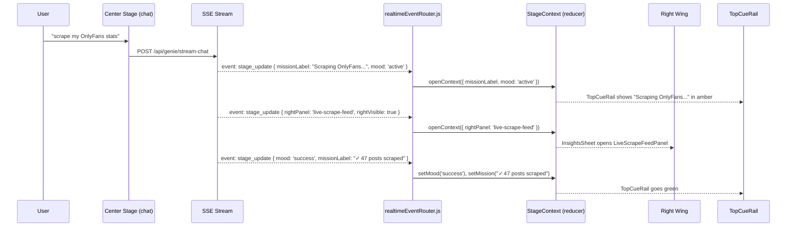
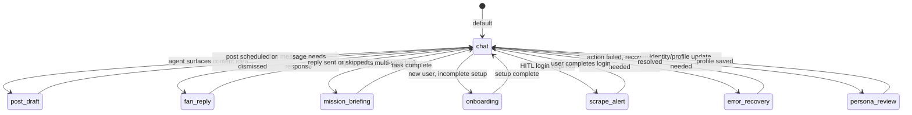

Most dashboards are component museums — a grid of widgets the user navigates between, each demanding attention on its own schedule. The user serves the interface.

GenieHelper inverts this. The AI decides what context is relevant. The interface assembles itself around the conversation.

## The theatrical model

The UI is built around a theatre metaphor. The audience faces one thing at a time, but the wings and the pit are always alive, ready to deliver. There is no navigation in the traditional sense — the agent opens panels, shifts modes, and updates context cues as the conversation progresses.

```
┌─────────────────────────────────────────────────────────────────────┐
│  TopCueRail — mission label + mood indicator + platform health       │
├──────────────────┬──────────────────────┬───────────────────────────┤
│                  │                      │                           │
│   LEFT WING      │    CENTER STAGE      │     RIGHT WING            │
│   ToolsSheet     │  CenterStageViewport │    InsightsSheet          │
│                  │                      │                           │
│  Action panels:  │  centerMode:         │  Intelligence panels:     │
│  · vault         │  · chat              │  · live-scrape-feed       │
│  · platform-dock │  · post_draft        │  · analytics-basic        │
│  · media-vault   │  · fan_reply         │  · analytics-advanced     │
│  · mockup        │  · persona_review    │  · idea-radar             │
│  · post-workflow │  · mission_briefing  │  · taxonomy               │
│  · timeline      │  · onboarding        │  · fan-dossier            │
│  · identity      │  · error_recovery    │  · diagnostics            │
│  · sessions      │  · scrape_alert      │  · memory-graph           │
│                  │                      │                           │
│  [collapsed →    │  ← always present,   │  ← appears when agent     │
│   nav rail]      │    mode shifts with  │    surfaces insight]      │
│                  │    conversation]     │                           │
├──────────────────┴──────────────────────┴───────────────────────────┤
│  THE PIT — StickyActionPitDock                                       │
│  Persistent quick actions · skill shortcuts · active job progress    │
│  Collapsed by default · expands on agent request or user pull-up     │
└─────────────────────────────────────────────────────────────────────┘
                     ↑ NavRail (left edge, always present)
```

## Zone responsibilities

| Zone | Component | Driven by | Purpose |
|---|---|---|---|
| **Top Rail** | `TopCueRail.jsx` | `missionLabel` + `mood` state | Context cue — what the agent is working on. Mood shifts color: neutral → active → warning → success |
| **Center Stage** | `CenterStageViewport.jsx` | `centerMode` (8 modes) | Primary interaction — chat, post drafting, fan reply, onboarding, error recovery, scrape alert |
| **Left Wing** | `ToolsSheet.jsx` | `leftPanel` key | Tool panels — what you *do* (connect, upload, schedule, mockup) |
| **Right Wing** | `InsightsSheet.jsx` | `rightPanel` key | Intelligence panels — what you *know* (analytics, taxonomy, fan data, live feeds) |
| **The Pit** | `StickyActionPitDock.jsx` | `pitContent` + `pitExpanded` | Persistent quick-action dock — collapses to a sliver, expands on demand or agent trigger |
| **Nav Rail** | `NavRail.jsx` | Always visible | Primary navigation + left wing collapse toggle |

## How the agent drives the UI

The user does not navigate to panels. The agent opens them.

When a creator sends "scrape my OnlyFans stats", the following happens without a single click:

<Steps>
  <Step title="User sends a message">
    The creator types "scrape my OnlyFans stats" into the Center Stage chat. The message is sent via `POST /api/genie/stream-chat`.
  </Step>
  <Step title="SSE stream begins">
    The server opens an SSE stream. The first `stage_update` event carries `{ missionLabel: "Scraping OnlyFans...", mood: 'active' }`.
  </Step>
  <Step title="realtimeEventRouter intercepts">
    `realtimeEventRouter.js` receives the event and calls `openContext({ missionLabel, mood: 'active' })` on the `StageContext` reducer.
  </Step>
  <Step title="TopCueRail updates">
    The mission label changes to "Scraping OnlyFans..." and the rail color shifts to amber (active mood) — no user action required.
  </Step>
  <Step title="Right Wing opens">
    A second `stage_update` event carries `{ rightPanel: 'live-scrape-feed', rightVisible: true }`. The InsightsSheet opens `LiveScrapeFeedPanel` automatically.
  </Step>
  <Step title="Job completes">
    A final event sets `{ mood: 'success', missionLabel: "✓ 47 posts scraped" }`. The TopCueRail goes green.
  </Step>
</Steps>

No routing. No manual panel management. The conversation produces context; the interface adapts to it.



The full routing path: **Agent response → SSE event → `realtimeEventRouter.js` → `openContext()` → `stageReducer` → React re-render.**

No prop drilling. No imperative navigation. The state machine is the UI.

## Center mode states

The Center Stage is not a static chat window — it switches modes based on what the agent determines the user needs to do next.

| Mode | Triggered when |
|---|---|
| `chat` | Default — conversational agent interaction |
| `post_draft` | Agent surfaces a content idea ready to draft and schedule |
| `fan_reply` | A fan message needs a response — agent pre-drafts it |
| `mission_briefing` | Agent is starting a multi-step task and surfaces its plan |
| `onboarding` | New user with incomplete platform setup |
| `scrape_alert` | HITL login required — platform blocked headless Chrome |
| `error_recovery` | An action failed and the agent needs human input to recover |
| `persona_review` | Identity or profile update needs creator confirmation |



## The 17 panels

Every panel is registered in `skillRegistry.js` with a left or right slot assignment. The agent references a panel by key; the registry resolves the component and target.

<AccordionGroup>
  <Accordion title="Left Wing — action panels (ToolsSheet)">
    | Key | Component | Purpose |
    |---|---|---|
    | `vault` | `ConnectionVaultPanel` | Manage platform credentials and API connections |
    | `platform-dock` | `PlatformDockPanel` | Live platform health and session status |
    | `mockup` | `MockupStudioPanel` | Preview post mockups across platform layouts |
    | `sessions-console` | `SessionsConsolePanel` | Active browser sessions and HITL queue |
    | `media-vault` | `MediaVaultPanel` | Media asset library — upload, browse, manage |
    | `identity-studio` | `IdentityStudioPanel` | Creator persona, voice settings, content boundaries |
    | `timeline` | `TimelinePanel` | Editorial calendar and publish queue |
    | `protection-inspector` | `ProtectionInspectorPanel` | Steganographic watermark verification |
    | `post-workflow` | `PostWorkflowPanel` | Post drafting, scheduling, and variant management |
  </Accordion>
  <Accordion title="Right Wing — intelligence panels (InsightsSheet)">
    | Key | Component | Purpose |
    |---|---|---|
    | `live-scrape-feed` | `LiveScrapeFeedPanel` | Real-time scrape job output and status |
    | `analytics-basic` | `AnalyticsBasicPanel` | Revenue, subscriber count, and engagement summaries |
    | `analytics-advanced` | `AnalyticsAdvancedPanel` | Campaign ROI, platform breakdown, goal progress |
    | `idea-radar` | `IdeaRadarPanel` | AI-scored content ideas from the idea inbox |
    | `taxonomy` | `TaxonomyPanel` | Browse and search the 3,205-node content taxonomy |
    | `fan-dossier` | `FanDossierPanel` | Full fan profile, memories, scores, and history |
    | `diagnostics` | `DiagnosticsDrawer` | System health, job queue status, error logs |
    | `memory-graph` | `MemoryGraphPanel` | DuckDB skill graph visualization (deferred) |
  </Accordion>
</AccordionGroup>

<Note>
  All 17 panels were completed in Sprint 9/10. Panel availability within a session is governed by the creator's subscription tier — `skillRegistry.js` includes a `tier` array per panel entry.
</Note>

## skillRegistry.js — the wiring layer

Every panel is registered in `dashboard/src/shared/skillRegistry.js`. The registry maps a short key to a component ID and a `stageTarget` (`'left'` or `'right'`). The agent emits a key in an SSE event; the registry resolves where it goes.

```javascript
// Excerpt from skillRegistry.js
{
  key: 'live-scrape-feed',
  componentId: 'LiveScrapeFeedPanel',
  stageTarget: 'right',        // → InsightsSheet
  label: 'Live Scrape Feed',
  tier: ['creator', 'pro', 'studio'],
},
{
  key: 'post-workflow',
  componentId: 'PostWorkflowPanel',
  stageTarget: 'left',         // → ToolsSheet
  label: 'Post Workflow',
  tier: ['starter', 'creator', 'pro', 'studio'],
},
```

The agent never references DOM elements or React components directly. It emits a skill key in an SSE `stage_update` event. `realtimeEventRouter.js` reads the key, looks up the registry entry, and calls `openContext()` with the resolved target. `stageReducer` handles the rest.

<Tip>
  To add a new panel, register it in `skillRegistry.js` with a unique key, a component ID, a `stageTarget`, and the tiers that can access it. The Stage system will handle routing automatically.
</Tip>

## Mobile: three surfaces, one at a time

On mobile, the three spatial zones collapse into a surface switcher. The agent still drives which surface is active — it is presented as a tab transition instead of a side-by-side layout.

```
Mobile surface toggle (SurfaceToggle.jsx):
┌──────────┬──────────────┬──────────┐
│  TOOLS   │   CHAT ●     │ INSIGHTS │
│ToolsSheet│ CenterStage  │InsightsSh│
└──────────┴──────────────┴──────────┘
           activeSurface state
```

When the agent opens a right panel on mobile, `activeSurface` shifts to `'insights'` — the user lands on the insight without navigating. When a left panel opens, `activeSurface` shifts to `'tools'`. The same SSE-driven logic applies; the viewport constraint is the only difference.
